# Ecliptic — writeup

Nishon IP-manzili ( `10.15.0.17` ) bo‘yicha to‘liq TCP portlar skanerlandi ( `nmap -p- 10.15.0.17 --min-rate=5000` ). Tizimda 22-portda SSH, 80-portda HTTP, shuningdek 135, 139, 443, 445 va boshqa Windows xizmat portlari ochiq ekani aniqlandi.

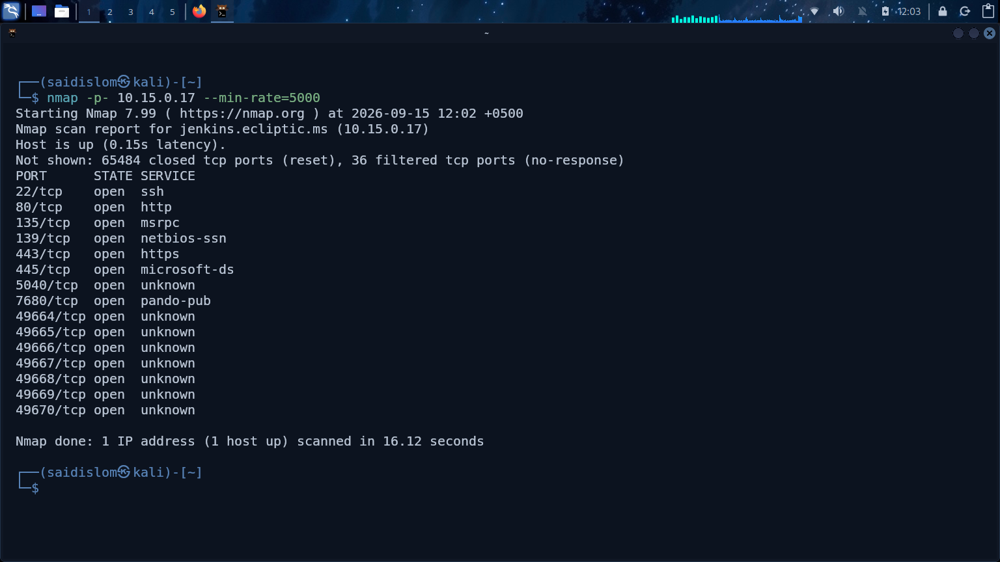

Brauzer orqali nishon veb-sayti ( `http://jenkins.ecliptic.ms/` ) ochildi va Jenkins avtomatlashtirish serverining kirish sahifasi ko‘zdan kechirildi.

Jenkins tizimiga standart yoki taxmin qilingan `admin:admin` (yoki shunga o'xshash) hisob ma'lumotlari kiritilib, autentifikatsiyadan o‘tishga harakat qilindi.

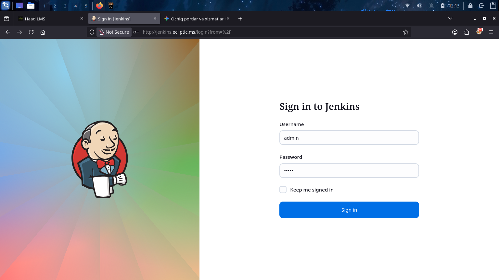

Muvaffaqiyatli autentifikatsiyadan so‘ng, admin profilingiz bilan Jenkins boshqaruv paneliga (Dashboard) kirildi.

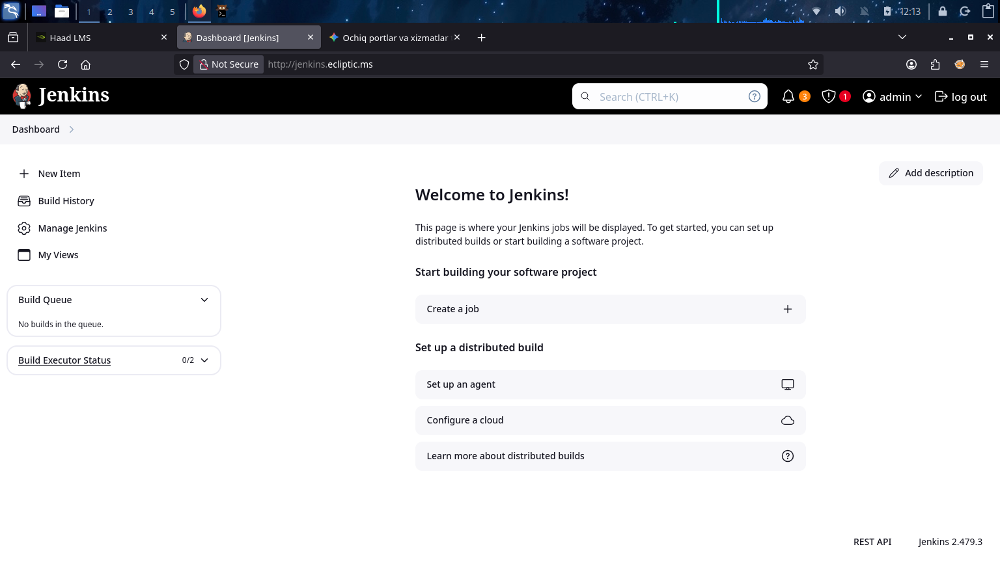

Hujumchi mashinasida `nc -lvp 4444` buyrug‘i orqali netcat tinglovchisi (listener) ishga tushirildi.

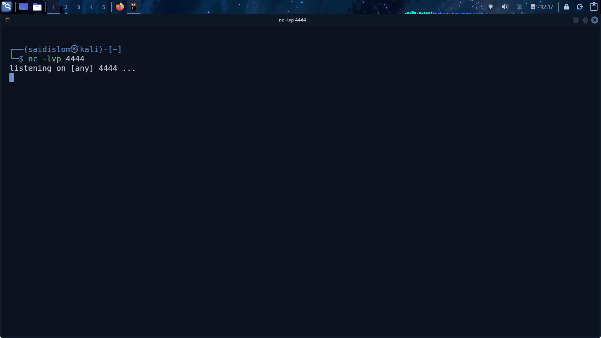

GitHub gist (frohoff) orqali Java/Groovy tilida yozilgan "Pure Groovy/Java Reverse Shell" kodi topildi va undan foydalanishga qaror qilindi.

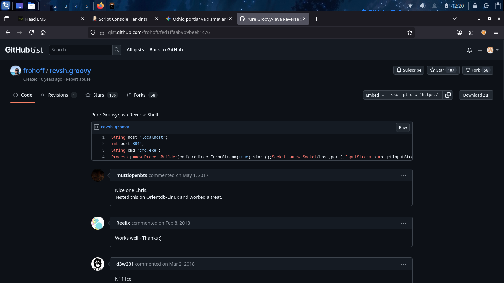

Jenkins'ning Script Console (`/script`) sahifasiga o‘tildi va u yerga tayyorlangan Groovy reverse shell kodi kiritildi. Kodda hujumchi IP-manzili (`10.8.0.180`) va porti (`4444`) ko‘rsatilib, tizimda `cmd.exe` ni ishga tushirish belgilandi hamda kod ijro etildi.

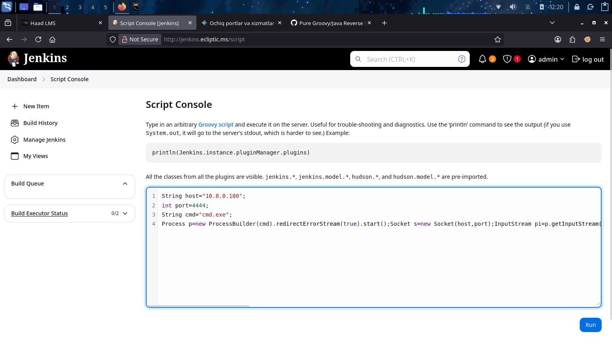

Netcat tinglovchisida nishon tizimdan ulanish qabul qilindi. Natijada `C:\Jenkins>` papkasida qobiq (shell) ochildi va tizim Windows ekanligi tasdiqlandi.

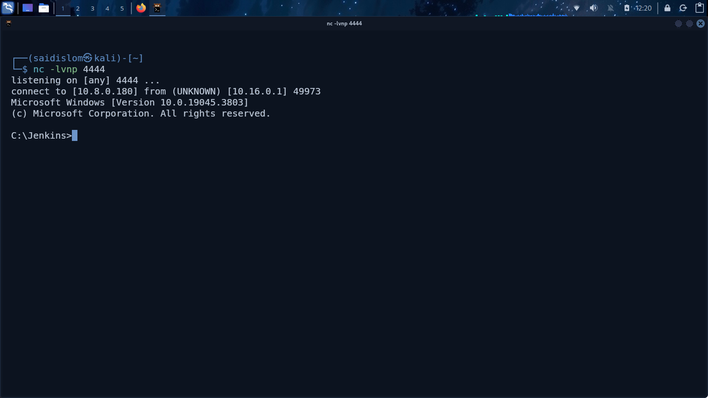

Tizimda `Ecliptic` foydalanuvchisining ish stoli (`Desktop`) jildiga o‘tildi va `user.txt` flagi (`0bab2ac2c6601d93eb8efb7fd9e05dac`) muvaffaqiyatli o‘qildi.

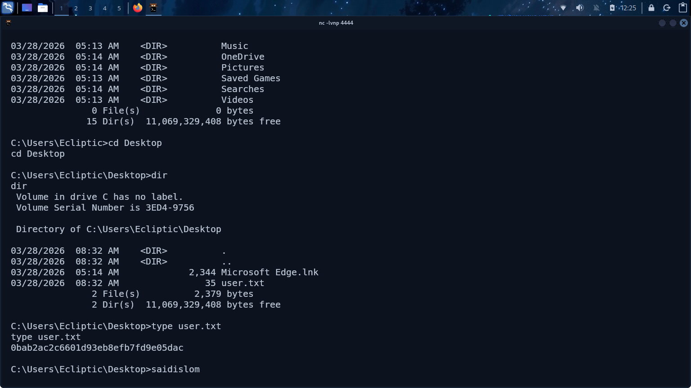

Foydalanuvchining imtiyozlarini tekshirish maqsadida `whoami /priv` buyrug‘i ishga tushirildi. Natijada `SeImpersonatePrivilege` (Impersonate a client after authentication) imtiyozi yoniq (Enabled) ekanligi aniqlandi. Tizimda PrintSpoofer mavjudligini tekshirish uchun `/priv` va `PrintSpoofer.exe` ni ishga tushirishga urinish amalga oshirildi, biroq topilmadi.

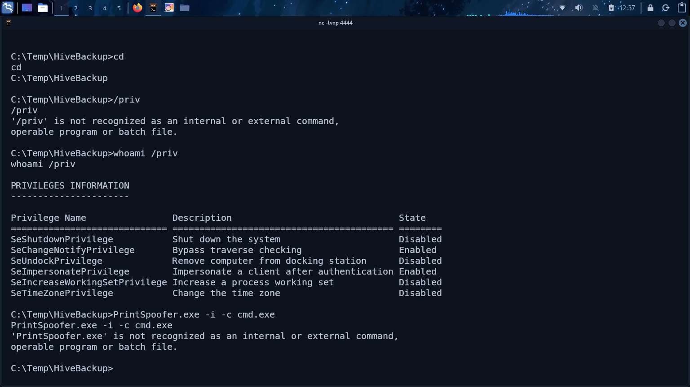

Ushbu imtiyozdan foydalanish uchun GitHub'dan (`itm4n/PrintSpoofer`) PrintSpoofer vositasining so‘nggi versiyasi (PrintSpoofer64.exe) yuklab olindi.

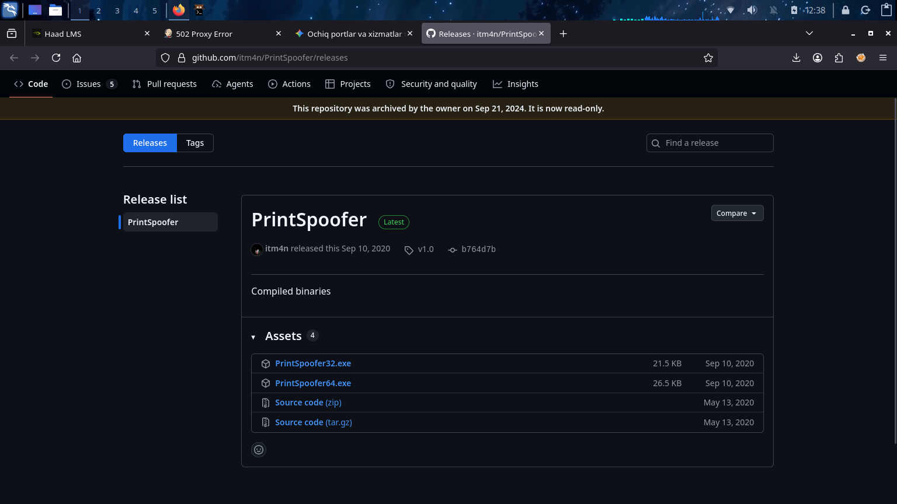

Yuklab olingan vosita hujumchi mashinasida `python3 -m http.server 8000` orqali tarmoqqa uzatildi va nishon mashinaning `C:\Temp` jildiga yuklab olindi.

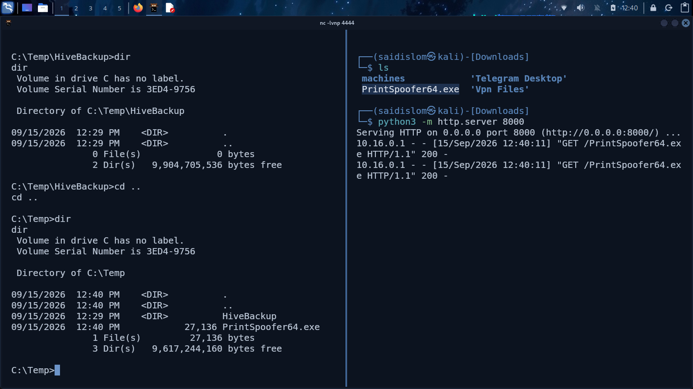

`PrintSpoofer64.exe -i -c cmd.exe` buyrug‘i ijro etilib, Privilege Escalation (imtiyozlarni oshirish) amalga oshirildi va tizimda eng yuqori bo‘lgan `nt authority\system` huquqi qo‘lga kiritildi.

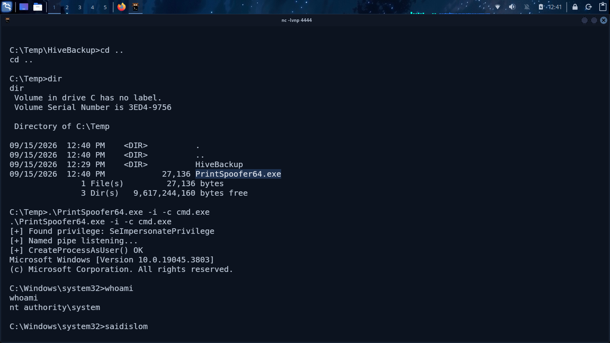

Administrator huquqi ostida `C:\Users\administrator\Desktop` jildidagi `root.txt` flagi (`eb9d68c053c04e239b6875cd30f2c7bb`) muvaffaqiyatli o‘qildi.

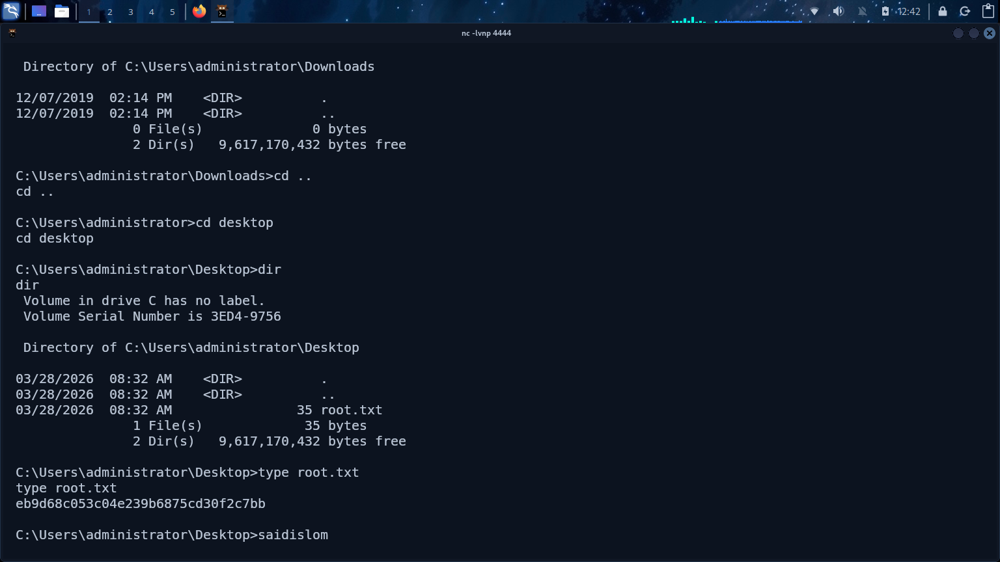

### Xulosa va Zaifliklar tahlili:
Ecliptic mashinasi quyidagi asosiy bosqichlar va zaifliklar zanjiridan iborat bo‘ldi:

* **Reconnaissance & Enumeration:** Nishon IP (`10.15.0.17`) tarmog'ida 80-port ochiqligi va `jenkins.ecliptic.ms` domenida Jenkins xizmati ishlayotgani aniqlandi.
* **Weak Credentials:** Jenkins boshqaruv paneliga kirish uchun standart yoki zaif paroldan (`admin:admin`) foydalanilgani tizimga kirish imkonini berdi.
* **Initial Foothold (Remote Code Execution):** Jenkins'ning Script Console qismi orqali Groovy tilidagi reverse shell kodi ijro etildi va nishon tizimda boshlang'ich qobiq (shell) qo'lga kiritildi.
* **Privilege Escalation (Root/SYSTEM):** Olingan foydalanuvchi huquqlarida `SeImpersonatePrivilege` imtiyozi yoniq ekanligi ma'lum bo'ldi. GitHub'dan `PrintSpoofer64.exe` vositasini yuklab olib, ushbu imtiyoz orqali `NT AUTHORITY\SYSTEM` (Administrator) huquqiga ko'tarilish amalga oshirildi.
